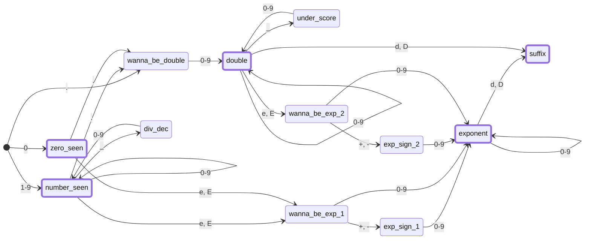

```mermaid
stateDiagram-v2
    direction LR

    [*] --> number_seen: 1-9
    [*] --> zero_seen: 0
    [*] --> wanna_be_double: .

    number_seen --> number_seen: 0-9
    number_seen --> div_dec: _
    div_dec --> number_seen: 0-9

    number_seen --> wanna_be_double: .
    zero_seen --> wanna_be_double: .

    wanna_be_double --> double: 0-9
    double --> double: 0-9
    double --> under_score: _
    under_score --> double: 0-9

    number_seen --> wanna_be_exp_1: e, E
    zero_seen --> wanna_be_exp_1: e, E
    wanna_be_exp_1 --> exp_sign_1: +, -
    exp_sign_1 --> exponent: 0-9
    wanna_be_exp_1 --> exponent: 0-9

    double --> wanna_be_exp_2: e, E
    wanna_be_exp_2 --> exp_sign_2: +, -
    exp_sign_2 --> exponent: 0-9
    wanna_be_exp_2 --> exponent: 0-9

    exponent --> exponent: 0-9

    exponent --> suffix: d, D
    double --> suffix: d, D

    classDef finalState stroke-width:4px,stroke:#2e7d32v
    class number_seen finalState
    class zero_seen finalState
    class double finalState
    class exponent finalState
    class suffix finalState
```